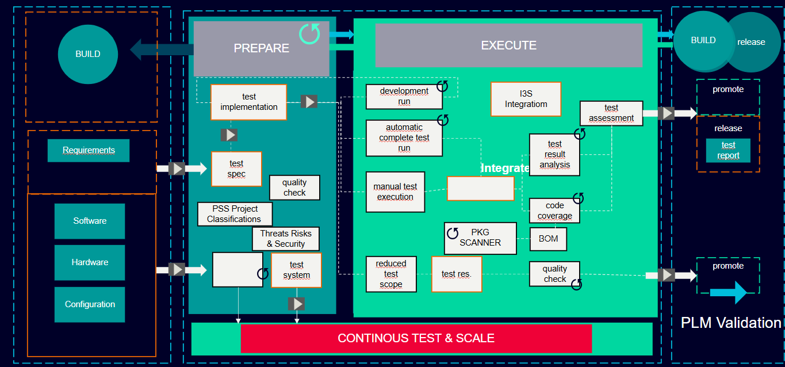

## 👋 Hi, I’m Muhammad Farhan   *An 🗣️enthusiastic ,  🧠curious, 🚀innovative  & 🧗🏾‍♀️passionate about making technology purposeful and sellable*.   
- - To give you a bit of perspective of my expertise for Realtime mission critical systems & processes that cover all of the design, implementation, verification & deployment. Over a decade, I have spent thousands of man hours in managing operations & developing & industrial graded systems & Realtime solution for large scale processing
 
<!-- ## AI Architect (Quality Assurance) Highly responsible & naturally curious SQA professional with over 15 years of demonstrated success, 

- - supported by strong credentials of releasing commercially viable products and solutions to customers in timely and cost effectively manner. -->
▶ As a seasoned Full Stack Development Engineer with over 10 years of practical development experience, with strong analytical skills and expertise in broad range of technologies.

▶ Demonstrated ability to create innovative AI solutions for diverse applications such as natural language processing, computer vision, and autonomous systems.

▶ Having hands on product development experience in IoT domain, specifically covered back-end development using Java, Python and related open source technologies.

▶ Experience in Agile software development using SCRUM.

▶ Expertise in Python, JavaScript, TypeScript, ReactJS, VueJS, Selenium, Postman, Playwright, Electron, Angular, Spring, ReadyAPI, Hibernate, MongoDB, MySQL and Cassandra.

▶ Proficient in design and development of software applications especially in software as a service (SaaS) layer and micro-services.

▶ Exposed to designing system level database, restful services.

▶ Having hands on experience in build automation using Jenkins, Gitlab CI, Circle CI

Throughout my career, I have successfully led and contributed to numerous projects, from inception through deployment, consistently ensuring optimal performance, security, and user experience. My proficiency in agile methodologies and collaborative environments enables me to work effectively within diverse teams, driving innovation and continuous improvement.

Sure, here is your content converted into a markdown list:

- **NLP application for Generative AI based LLM Model**
  - Scale up test development
  - Increase coverage
  - Improve overall execution speed

- **RAG and file embedding**
  - Serve specialized engineering copilot cases
  - Add test effectiveness and reusability aspects

- **Better recovery and less failovers**
  - Autonomous healing agents

- **Enhancing observability and monitoring capability**
  - Application analytics

- **Self-Healing & supervised services**

- **Anomaly detection and event reporting**

- **Access to real-time and historical data**

- **External data connectors**
  - Pulling data

- **Utilizing Machine Learning**
  - Acoustic monitoring
  - Vision monitoring

- **Recommendation Systems**

- **Predictive Analytics**

- **Inference engine / Anomaly Detection**

- **Skills and Collaboration**
  - Comprehensive, team player
  - Understanding of technical and domain-specific details
  - Ability to collaborate and build mutual agreements across the board

- **Speedy resolutions to common SDLC challenges**

- **Risk assessment, mitigation & management reporting**

- **Key technology expert and team leadership roles**
  - Siemens
  - Mentor Graphics
  - Intech Process Automation

- **Practical, usable and repeatable automation**
  - Apply continuous automation techniques and verification checkpoints
  - Within release workflows, testing pipelines, and external source dependencies
  - Assure deliverables meet timelines
  - Adhere to the highest standards of quality, availability, and maintainabilit

"Self-reflection is key to purposeful testing."

In spare time, I would like to go on long drive with family or friends.

 
Vulnerability management, Supply chain assurance & Cybersecurity 2.0
Extensive knowledge & working experience in secured by design format, I have performed detailed assessments, security goals, targets definition, mitigation plan and continuous automated compliance checks with NIST and OSWAP provided criteria / checklists.
⦁ Identity and Access Right Management (Zero Trust and TLS)
⦁ Technical risk assessment and Project Risk classification (TRA, PSS)
⦁ Devices and application penetration score  (Pen testing)
⦁ Data privacy and confidentiality.(GDPR)
⦁ Export & Custom control (ECC) 
⦁ compliant health & safety auxiliaries, 
⦁ Known providers’ checklists and best practices

###  AI & Data Intelligence Systems 
    - Industrial IoT Systems
    - Data intelligence & AI workflows
      - Machine Learning
       - Model training & deployment
    -Industrial AI & 🤖Robotics
---
<iframe src="https://www.slideshare.net/slideshow/embed_code/key/vrFekps3ETJcT9?startSlide=1" width="670" height="715" frameborder="0" marginwidth="0" marginheight="0" scrolling="no" style="border:1px solid #CCC; border-width:1px; margin-bottom:5px;max-width: 100%;" allowfullscreen></iframe>
<strong><a href="https://www.slideshare.net/slideshow/technologies-ai-machine-learning-predictive-analytics-iiot-cloudwebframeworks-data-simulation-and-virtualization/267217262" title="(Technologies) AI, Machine Learning, Predictive Analytics, IIOT, Cloud,Web-frameworks, Data Simulation and Virtualization" target="_blank">(Technologies) AI, Machine Learning, Predictive Analytics, IIOT, Cloud,Web-frameworks, Data Simulation and Virtualization</a></strong> from <strong><a href="https://www.slideshare.net/FarhanTariq1" target="_blank">Muhammad Farhan</a></strong>

<h3 align="left">Languages and Tools:</h3>

                                

---

👀 I’m interested in collaboration, learning and technology, I work for SIEMENS as key technology expert. Please see some of the highlights & 
---

🤝[linkedIn](https://www.linkedin.com/in/engr-farhan/)

